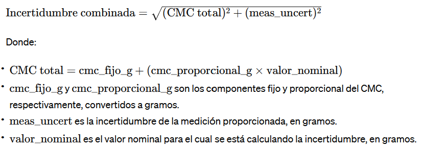

# Calibration Assistant and PDF Certificate Processor

## Overview

This project consists of two main components: a Calibration Assistant for uncertainty calculations and a PDF Certificate Processor. These tools are designed to streamline the process of managing calibration data and certificates for measurement equipment.

## Calibration Assistant

### 1. Equipment Model Search

- **Model Input**: Users initiate the interaction by entering part of the equipment model in a text field. This action triggers a search in a certificate database for matches.

- **Certificate Selection**: Certificates matching the entered model are presented to the user. The user selects the desired certificate from the provided list.

- **Calibration Details Selection**:
  - With the selected certificate, options are displayed to define the target measurement group, nominal value, and unit of measurement.
  - The user chooses the target measurement group (e.g., 'weight_-_linearity_down'), selects the specific nominal value within that group, and the corresponding unit of measurement.

- **Uncertainty Calculation**: The application calculates the measurement uncertainty based on the user's selection, using data from the selected certificate. The specified measurement uncertainty and CMC (Calibration and Measurement Capability) are taken into account, performing internal calculations to determine the total uncertainty.

- **Results**: The selected details and the result of the total uncertainty calculation are presented to the user.

### 2. Manual Certificate Number Entry

- **Certificate Number Input**: In this mode, the user directly enters the certificate number instead of searching by model.

- **Calibration Details Selection**: Similar to the process after selecting a certificate in the model search, the user chooses the target measurement group, specific nominal value, and unit of measurement.

- **Uncertainty Calculation**: Using the manually entered data, the system calculates the total uncertainty in the same way as in the model search process, using the provided measurement uncertainty and CMC for calculations.

- **Results**: The user is shown the details of their selection along with the result of the total uncertainty calculation.

### Important Notes on Uncertainty Calculation Logic

- For both methods, the uncertainty calculation is based on the same principles and uses the same function or method. The main difference lies in how the user accesses the stage of selecting specific details for the calculation (model search vs. manual certificate number entry).
- The selection of the target group, nominal value, and unit of measurement are crucial steps that determine the specific parameters for the uncertainty calculation.
- Certificate data includes measurement uncertainty and CMC, fundamental elements for calculating total uncertainty.
- The calculation considers the nominal value in grams (converted if necessary), fixed CMC, proportional CMC, and specified measurement uncertainty, combining them to produce the total uncertainty expressed in grams, milligrams, and micrograms.

## PDF Certificate Processor

### Application Startup in Streamlit:

- The Streamlit application starts with a descriptive title and a file uploader that accepts PDF files.

### PDF Loading and Processing:

- The user uploads a PDF file.
- The PDF file is temporarily saved for processing.
- The certificate number is extracted from the PDF using `PyMuPDF` (fitz) and regular expressions, identifying a specific pattern within the first page of the document.

### Table Extraction from PDF:

- The PDF is processed page by page.
  - For the first page, tables are extracted using specific coordinates that capture precise areas of interest.
  - For subsequent pages, extraction areas are adjusted and specific columns are defined if necessary to adapt to possible variations in table structure or format.
- It is determined if some columns within the extracted tables should be removed based on specific criteria, such as the presence of certain characters or lack of significant data.

### XLSX File Generation:

- The extracted data is organized and saved in an XLSX file in memory, using `openpyxl`.
- The user is offered the option to download this XLSX file.

### XLSX to JSON Conversion:

- The XLSX file in memory is processed to convert the table data to JSON format.
  - Specifically, the first sheet is processed to extract general certificate data.
  - Subsequent sheets are processed to extract measurement and results data, omitting specific lines or keywords that are not relevant for data structuring.
- The data converted to JSON is offered to the user for download.

### Cumulative JSON File Update:

- A cumulative JSON file (`certificate_data.json`) is updated with the new certificate data.
- This file maintains a collection of all processed certificates, using the certificate number as a key for each entry.
- If the file doesn't exist, it's created; if it already exists, it's read and updated with the new data without overwriting existing data.

### Error Handling and Cleanup:

- Possible errors during the process are handled, such as issues when deleting the temporary PDF file.
- The cleanup of temporary resources and proper process termination are ensured.

### Specific Considerations

#### Table Extraction and Processing:

- Specific techniques are used to adjust table extraction to different formats found in PDFs, including defining extraction areas and removing columns based on specific content.

#### Adjustments in Data Extraction for JSON:

- The process of converting data to JSON is adjusted to handle variations in table data, such as omitting certain lines or adjusting the handling of merged cells.
